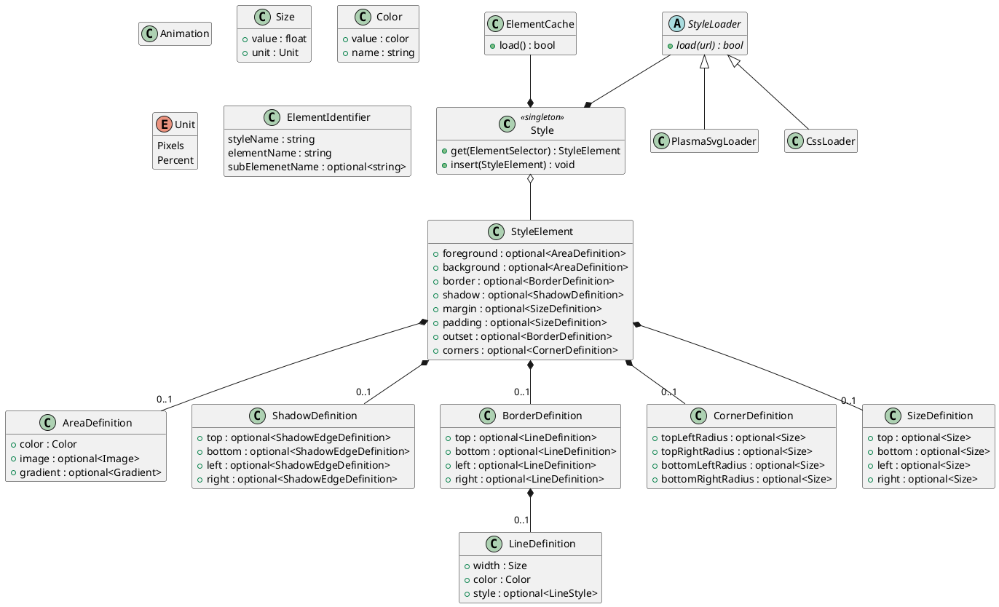

```plantuml
@startuml

class Style <<singleton>> {
+ get(ElementSelector) : StyleElement
+ insert(StyleElement) : void
}

class ElementCache {
+ load() : bool
}

abstract class StyleLoader {
+ {abstract} load(url) : bool
}

class PlasmaSvgLoader
class CssLoader

class StyleElement {
+ foreground : optional<AreaDefinition>
+ background : optional<AreaDefinition>
+ border : optional<BorderDefinition>
+ shadow : optional<ShadowDefinition>
+ margin : optional<SizeDefinition>
+ padding : optional<SizeDefinition>
+ outset : optional<BorderDefinition>
+ corners : optional<CornerDefinition>
}

class AreaDefinition {
+ color : Color
+ image : optional<Image>
+ gradient : optional<Gradient>
}

class ShadowDefinition {
+ top : optional<ShadowEdgeDefinition>
+ bottom : optional<ShadowEdgeDefinition>
+ left : optional<ShadowEdgeDefinition>
+ right : optional<ShadowEdgeDefinition>
}

class BorderDefinition {
+ top : optional<LineDefinition>
+ bottom : optional<LineDefinition>
+ left : optional<LineDefinition>
+ right : optional<LineDefinition>
}

class CornerDefinition {
+ topLeftRadius : optional<Size>
+ topRightRadius : optional<Size>
+ bottomLeftRadius : optional<Size>
+ bottomRightRadius : optional<Size>
}

class SizeDefinition {
+ top : optional<Size>
+ bottom : optional<Size>
+ left : optional<Size>
+ right : optional<Size>
}

class LineDefinition {
+ width : Size
+ color : Color
+ style : optional<LineStyle>
}

class Animation {
}

class Size {
+ value : float
+ unit : Unit
}

class Color {
+ value : color
+ name : string
}

enum Unit {
    Pixels
    Percent
}

class ElementIdentifier {
    styleName : string
    elementName : string
    subElemenetName : optional<string>
}

StyleLoader --* Style
ElementCache --* Style
Style o-- StyleElement

StyleLoader <|-- PlasmaSvgLoader
StyleLoader <|-- CssLoader

StyleElement *-- "0..1" AreaDefinition
StyleElement *-- "0..1" BorderDefinition
StyleElement *-- "0..1" ShadowDefinition
StyleElement *-- "0..1" CornerDefinition
StyleElement *-- "0..1" SizeDefinition

BorderDefinition *-- "0..1" LineDefinition

hide empty members

@enduml
```
